title: Geometry Processing Course
author: Klint Qinami, Alec Jacobson
html header:  <link rel="stylesheet" href=style.css>

# Geometry Processing

Winter Term 2017  
CSC2521 [Topics in Computer Graphics: Geometry Processing]  
Prof. Alec Jacobson  
W 3-5 BA 5187 (via BA 5166)  

The class is aimed at preparing students for working with geometric data via
understanding fundamental theoretical concepts. Students should have a
background in _Linear Algebra_ and _Computer Programming_. Previous
experience with _Numerical Methods_, _Differential Equations_, and _Differential
Geometry_ is appreciated but not required.

Extending traditional signal processing, _geometry processing_ interprets
three-dimensional curves and surfaces as signals. Just as audio and image
signal data can be filtered, denoised and decomposed spectrally, so can the
geometry of a three-dimensional curve or surface.

In this course, we study the algorithms and mathematics behind fundamental
operations for interpreting and manipulating geometric data. These essential
tools enable: geometric modeling for computer aided design, life-like
animations for computer graphics, reliable physical simulations,  and robust
scene representations for computer vision.

Topics include: discrete curves and surfaces, curvature computation, surface
reconstruction from point clouds, surface smoothing and denoising, mesh
simplification, parameterization, symmetry detection, shape deformation and
animation.

## Organization

In lecture we will cover the mathematical background and visual intuition of
the week's topic. At home, students will complete a small **_weekly_**
programming assignment to implement a corresponding algorithm. By the end of
the semester, these algorithms compose a toolbox that students can use to
create a unique _artifact_: the **_final project_** is to use these tools to
create a unique piece of geometry to visualize (as an image or interactive
experience) or 3D print. 

_Below is a work in progress. Stay tuned._

## Objectives

 1. Students should understand, derive, and implement solutions to the
 prominent challenges that arise in geometry processing applications.
 2. Students should create a final creative project showcasing their
 implementation of the different processing algorithms.
 3. Students should develop an understanding of the mathematical underpinnings
 of geometry processing including useful discretized operators and energies.
 4. Students should develop a working knowledge of
 [libigl](http://libigl.github.io/libigl/) to develop these algorithms without
 worrying about the grunt-work of
 [OpenGL](https://en.wikipedia.org/wiki/OpenGL) viewers, quadrature, etc.

## Prerequisites

Students should have already taken **Linear Algebra** and **Calculus**.

Students should have already taken **Introduction to Computer Science** and
should be _proficient_ in computer programming (in any language) and should
feel comfortable programming in **C++**.

While knowledge of **Partial Differential Equations** _is not required_, it will
certainly be very handy for derivations. A quick survey will be posted to help
students evaluate their readiness on these topics.

On the programming side, we will be coding mainly in **C++** and using a
miniature version of [libigl](http://libigl.github.io/libigl/), an open-source
geometry processing library. We will be using
[Eigen](http://eigen.tuxfamily.org) for computational linear algebra, and
[Cmake](http://cmake.org) for building the coding assignments.

## Topics

### 1\. Acquisition and Reconstruction

Recent developments in scanning technology have dramatically increased our
capability to faithfully represent real-world objects virtually. Take the
Stanford Bunny, which can be scanned into a cloud of 3D coordinates by a laser scanner. 

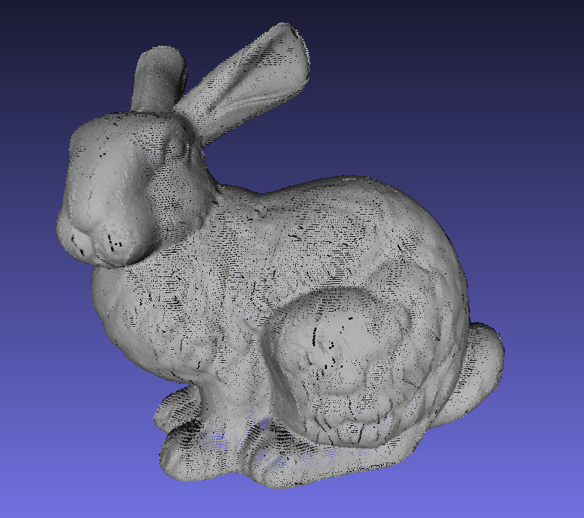

We can convert the loose set of points into a closed surface composed of many
small triangles, a triangle mesh. Triangle meshes are the most popular discrete representation for continuous
surfaces on the computer. We can save the mesh to a file and load it into other
programs, for example [libigl](http://libigl.github.io/libigl/)'s viewer:

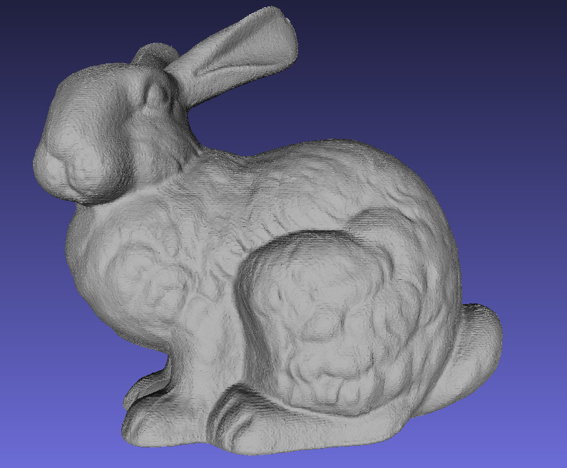

's viewer renders the same bunny.](images/stanfordBunnyMesh.jpg)

### 2\. Surface Fairing and Denoising

If the scan was not so good, it is possible that the reconstructed mesh surface
is noisy. To illustrate this point, I have artificially introduced random noise
to the vertices of the bunny mesh. To fix this, I ran one step of implicit mean
curvature flow to smooth the bunny.

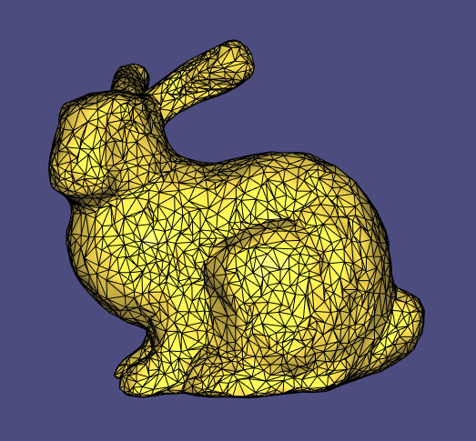

Continuing to smooth the bunny has an interesting effect. Eventually even low
frequency details disappear. And finally the bunny simply becomes a sphere.

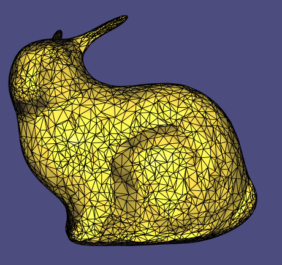

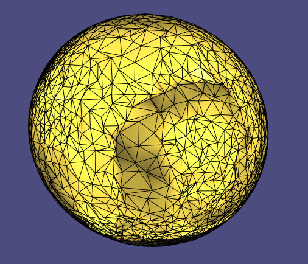

### 3\. Mesh Simplification

Some algorithms demand such computing power that it may be reasonable to reduce
the complexity of our mesh by representing the geometry with fewer faces. Using
a greedy algorithm to assign edge collapse weights, we can achieve remarkably
nice results as shown on this fertility mesh

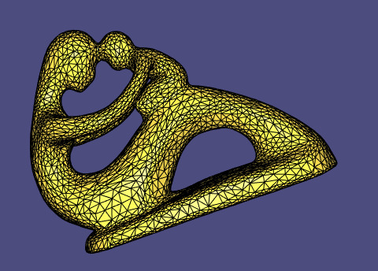

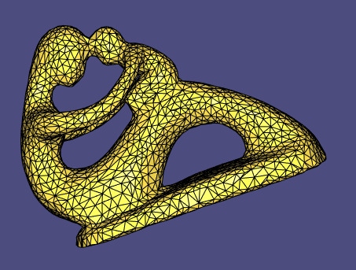

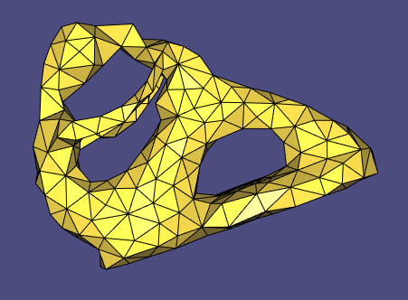

### 4\. Mesh Parametrization

Remarkably, using the smoothing machinery and tweaking a bit, we can create 2D
parametrizations for our 3D surfaces. If we have a mesh with a boundary, one
simple technique we can use is to map the boundary to the unit circle and then
place the remaining vertices within the disk in such a way that we minimize
displacement. Using the Dirichlet Energy as a measure, we can achieve harmonic
parametrization of this Lion mesh

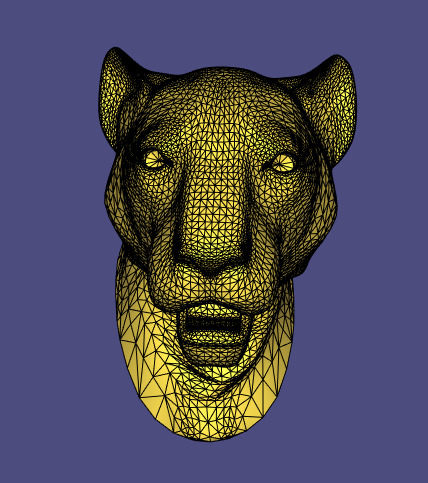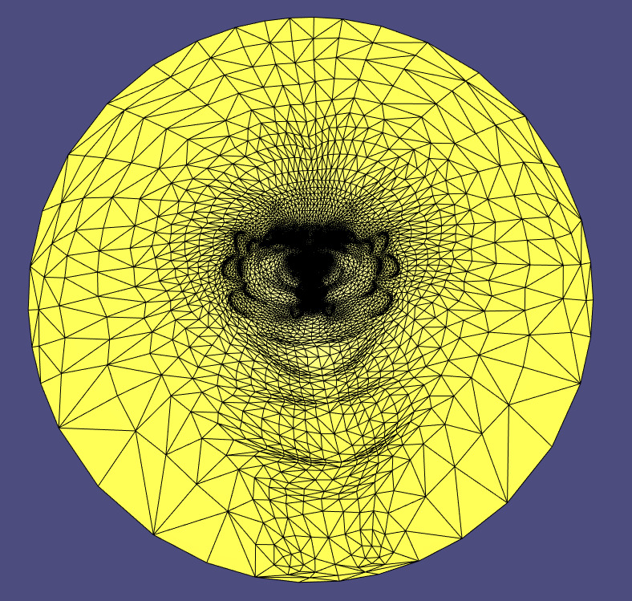

Because we restrict the boundary, this method can cause the parametrization to
warp angles and areas. Using a Least Squares Conformal Mapping, we can free the
boundary, show below on the left. Even beyond freeing the boundary, we can come
up with an As Rigid As Possible parametrization and use LSCM as a starting
point to improve upon, shown below on the right.

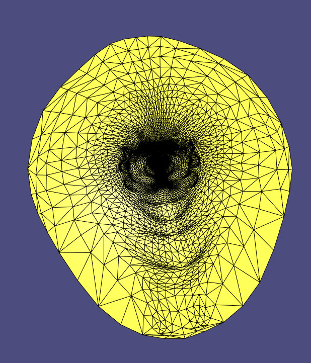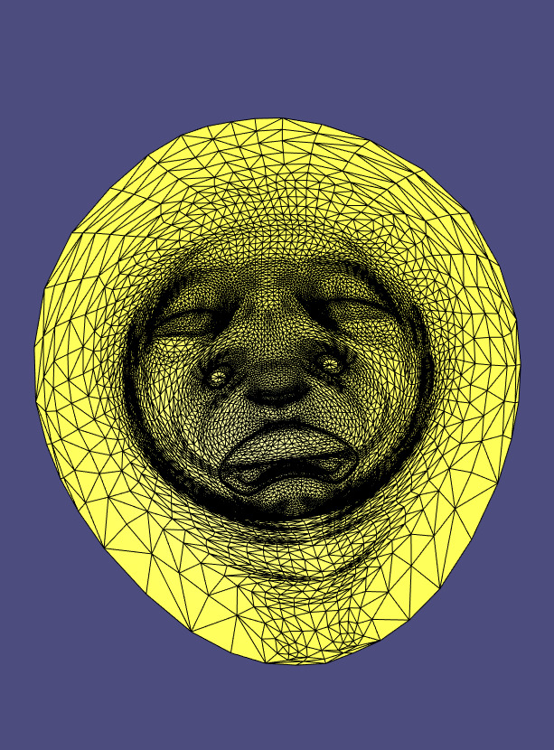

This parametrization can be used to overlay textures onto the original surface,
as it is already a planar representation of our three dimensional object.
Because of our choice of energies and physically based techniques, we can be
sure to get as little distortion in the mapping as we aimed for angle and area
preservation.

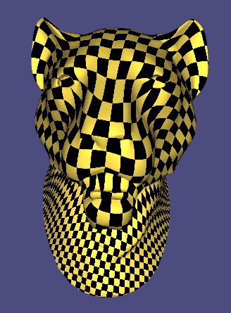

### 5\. Remeshing

Even though it may seem like triangle meshes are in fact all we ever work with,
there is no reason to restrict ourselves. In fact, there are sometimes benefits
to working with quadrilateral meshes instead. Due to this, there is quite a bit
of literature on developing good remeshing algorithms. Here is an example of
the transformation from a triangle mesh to a quad mesh

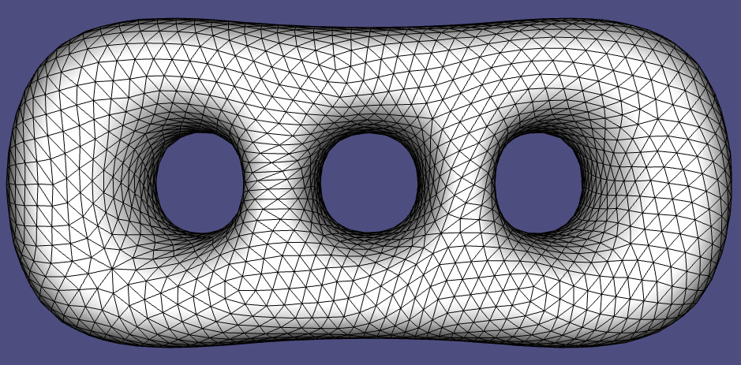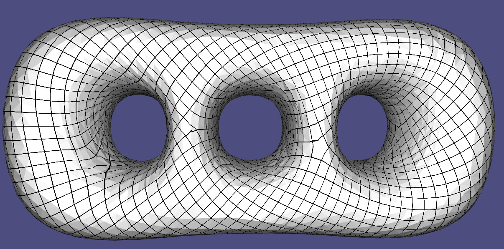

### 6\. Visualizing Mesh Features

The automatic detection of mesh features like symmetry, curvature, and
spin-axes are also useful tools for mesh analysis. Here is a plot of elliptic,
hyperbolic, and parabolic curvature on a bumpy square mesh

 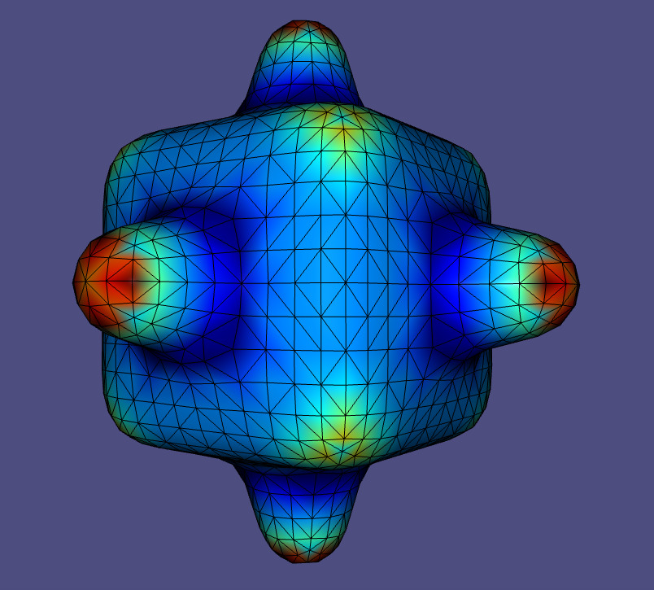 

### 7\. Deformations

Mesh deformation techniques allow users to create new meshes by deforming
existing ones. This has especially important implications for character
animations. Handle-based deformations allow users to specify the positions of a
few predetermined handle points and allows the algorithm to deduce the rest.
Creating physically plausible deformations of characters is a challenging task,
and often sophisticated mathematical concepts are hidden behind simple uses
interfaces. Here's a deformation of a knight character using an As Rigid As
Possible scheme

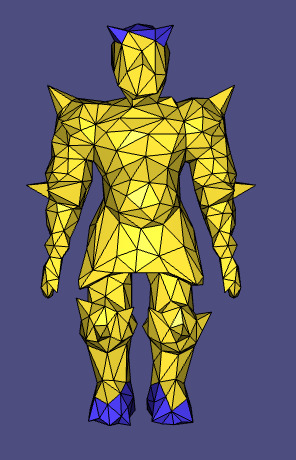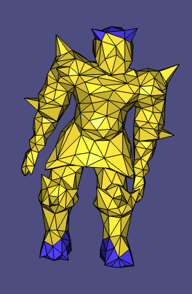

## A Mathematical Foundation

Much of the framing for our techniques will be looking at the continuous
analogue of our problem and discretizing it in an intrinsic way, preserving
continuous theorems as much as possible. We will discretize continuous
operators like the Laplacian and the Gradient, and we will find adequate
representations of concepts like normal vectors and curvature. Perhaps
surprisingly we will see that there are many choices of discretization, each
with their own benefits and downsides, prompting us to choose appropriately for
the particular application.

## Schedule

| Lecture Date          | Tentative Topic |
|:----------------------|:--|
| Wednesday, 11/01/2017 | **Geometry Processing Pipeline**, shapes, surface representations, data structures, linear algebra, libigl.   _Polygon Mesh Processing_ [Botsch et al. 2008]   _**HW 00 assigned**_
| Wednesday, 18/01/2017 | **Acquisition & reconstruction**, characteristic function, surface normals, scattered data interpolation, spatial gradient, spatial Laplacian, linear least squares,   "Poisson surface reconstruction" [Kazhdan et al. 2006]   _**HW 01 assigned**_
| Wednesday, 25/01/2017 | **Alignment & registration** Hausdorff distance, point-to-plane distance, iterative closest point, orthogonal Procrustes problem, sampling points on surfaces   "Object modelling by registration of multiple range images" [Chen & Medioni 1991]   "A method for registration of 3-D shapes" [Besl & McKay 1992]   "Sparse Iterative Closest Point" [Bouaziz et al. 2013]   _**HW 02 assigned**_ |
| Wednesday, 01/02/2017 | **Surface fairing & denoising**, Laplace-Beltrami, mean curvature, geometric flow, partial differential equations, cotangent Laplacian   "Curve and surface smoothing without shrinkage" [Taubin 1995]   "Skeleton extraction by mesh contraction" [Au et al. 2008]  "Can Mean-Curvature Flow Be Made Non-Singular" [Kazhdan et al. 2005] _**HW 03 assigned**_|
| Wednesday, 08/02/2017 | **Surface parameterization** |
| Wednesday, 15/02/2017 | **Shape deformation** |
| Wednesday, 22/02/2017 | **Curvature & surface analysis** |
| Wednesday, 01/03/2017 | **Mesh decimation, simplification, remeshing** |
| Wednesday, 08/03/2017 | **Quad meshing** |
| Wednesday, 15/03/2017 | **Subdivision surfaces**|
| Wednesday, 22/03/2017 | **Signed distances, constructive solid geometry, voxelization** |
| Wednesday, 29/03/2017 | **3D printing** |
| Wednesday, 05/04/2017 | |

## Supplemental Textbook

[_Polygon Mesh
Processing_](https://www.amazon.ca/Polygon-Mesh-Processing-Mario-Botsch/dp/1568814267/).
Mario Botsch, Leif Kobbelt, Mark Pauly, Pierre Alliez, and Bruno Levy, 2008.
