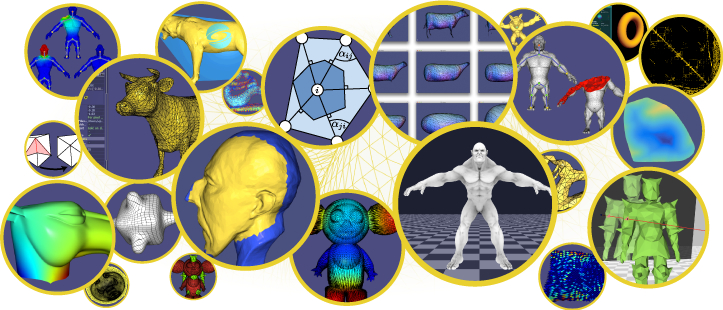

title: Geometry Processing Course
author: Klint Qinami, Alec Jacobson
html header:  <link rel="stylesheet" href=style.css>

# Geometry Processing

Winter Term 2017  
CSC2521 [Topics in Computer Graphics: Geometry Processing]  
Prof. Alec Jacobson  
W 3-5 BA 5187 (via BA 5166)  

The class is aimed at preparing students for working with geometric data via
understanding fundamental theoretical concepts. Students should have a
background in _Linear Algebra_ and _Computer Programming_. Previous
experience with _Numerical Methods_, _Differential Equations_, and _Differential
Geometry_ is appreciated but not required.

Extending traditional signal processing, _geometry processing_ interprets
three-dimensional curves and surfaces as signals. Just as audio and image
signal data can be filtered, denoised and decomposed spectrally, so can the
geometry of a three-dimensional curve or surface.

In this course, we study the algorithms and mathematics behind fundamental
operations for interpreting and manipulating geometric data. These essential
tools enable: geometric modeling for computer aided design, life-like
animations for computer graphics, reliable physical simulations,  and robust
scene representations for computer vision.

Topics include: discrete curves and surfaces, curvature computation, surface
reconstruction from point clouds, surface smoothing and denoising, mesh
simplification, parameterization, symmetry detection, shape deformation and
animation.

## Organization

In lecture we will cover the mathematical background and visual intuition of
the week's topic. At home, students will **_read academic papers_** and complete a
small **_weekly_** programming assignment to implement a corresponding
algorithm. By the end of the semester, these algorithms compose a toolbox that
students can use to create a unique _artifact_: the **_final project_** is to
use these tools to create a unique piece of geometry to visualize (as an image
or interactive experience) or 3D print. 

## Objectives

 1. Students should understand, derive, and implement solutions to the
 prominent challenges that arise in geometry processing applications.
 2. Students should create a final creative project showcasing their
 implementation of the different processing algorithms.
 3. Students should develop an understanding of the mathematical underpinnings
 of geometry processing including useful discretized operators and energies.
 4. Students should develop a working knowledge of
 [libigl](http://libigl.github.io/libigl/) to develop these algorithms without
 worrying about the grunt-work of
 [OpenGL](https://en.wikipedia.org/wiki/OpenGL) viewers, quadrature, etc.

## Prerequisites

Students should have already taken **Linear Algebra** and **Calculus**.

Students should have already taken **Introduction to Computer Science** and
should be _proficient_ in computer programming (in any language) and should
feel comfortable programming in **C++**.

While knowledge of **Partial Differential Equations** _is not required_, it will
certainly be very handy for derivations. A quick survey will be posted to help
students evaluate their readiness on these topics.

On the programming side, we will be coding mainly in **C++** and using a
[libigl](http://libigl.github.io/libigl/), an open-source geometry processing
library. We will be using [Eigen](http://eigen.tuxfamily.org) for computational
linear algebra, and [Cmake](http://cmake.org) for building the coding
assignments.

## A Mathematical Foundation

Much of the framing for our techniques will be looking at the continuous
analogue of our problem and discretizing it in an intrinsic way, preserving
continuous theorems as much as possible. We will discretize continuous
operators like the Laplacian and the Gradient, and we will find adequate
representations of concepts like normal vectors and curvature. Perhaps
surprisingly we will see that there are many choices of discretization, each
with their own benefits and downsides, prompting us to choose appropriately for
the particular application.

## Schedule

| Lecture Date          | Tentative Topic |
|:----------------------|:--|
| Wednesday, 11/01/2017 | [**Geometry Processing Pipeline**](lecture-notes/introduction.html), shapes, surface representations, tangents and normals, <del>data structures, linear algebra,</del>, topology, libigl.   _Polygon Mesh Processing_ [Botsch et al. 2008]   _**[HW 00 assigned](https://github.com/alecjacobson/geometry-processing-introduction), due 17/01/2017**_
| Wednesday, 18/01/2017 | [**Acquisition & reconstruction**](lecture-notes/mesh-reconstruction.html), discrete topology, meshes, characteristic function, scattered data interpolation, spatial gradient, spatial Laplacian, linear least squares,   "Poisson surface reconstruction" [Kazhdan et al. 2006]   _**HW 01 assigned**_
| Wednesday, 25/01/2017 | **Alignment & registration** Hausdorff distance, point-to-plane distance, iterative closest point, orthogonal Procrustes problem, sampling points on surfaces   "Object modelling by registration of multiple range images" [Chen & Medioni 1991]   "A method for registration of 3-D shapes" [Besl & McKay 1992]   "Sparse Iterative Closest Point" [Bouaziz et al. 2013]   _**HW 02 assigned**_ |
| Wednesday, 01/02/2017 | **Surface fairing & denoising**, Laplace-Beltrami, mean curvature, geometric flow, partial differential equations, cotangent Laplacian   "Curve and surface smoothing without shrinkage" [Taubin 1995]   "Skeleton extraction by mesh contraction" [Au et al. 2008]  "Can Mean-Curvature Flow Be Made Non-Singular" [Kazhdan et al. 2005] _**HW 03 assigned**_|
| Wednesday, 08/02/2017 | **Surface parameterization**, (or guest lecture) |
| Wednesday, 15/02/2017 | **Shape deformation** |
| Wednesday, 22/02/2017 | **Curvature & surface analysis** |
| Wednesday, 01/03/2017 | **Mesh decimation, simplification, remeshing** |
| Wednesday, 08/03/2017 | **Quad meshing** |
| Wednesday, 15/03/2017 | **Subdivision surfaces**|
| Wednesday, 22/03/2017 | **Signed distances, constructive solid geometry, voxelization** |
| Wednesday, 29/03/2017 | **3D printing** |
| Wednesday, 05/04/2017 | |

## Lateness Policy

0.007% off for every minute late.

## Supplemental Textbook

[_Polygon Mesh
Processing_](https://www.amazon.ca/Polygon-Mesh-Processing-Mario-Botsch/dp/1568814267/).
Mario Botsch, Leif Kobbelt, Mark Pauly, Pierre Alliez, and Bruno Levy, 2008.

## Grading

- 50% small assignments
- 25% final project: 
    - in-class presentation
    - formal two-page [technical extended
      abstract](http://s2017.siggraph.org/talks-submissions)
    - (less formal) in depth documentation
    - it's great if you can align with your research, but please discuss this
      with me early on.
- 20% participation: in class, reading papers, answering "Issues" on
  assignments
- 5% full-class collaborative project: improve
  [https://en.wikipedia.org/wiki/Geometry_processing](https://en.wikipedia.org/wiki/Geometry_processing)
  and [related
  topics](https://en.wikipedia.org/wiki/Category:Geometry_processing)
    - Graded based on delta of this page between now and end of term
    - Grade is shared by entire class

