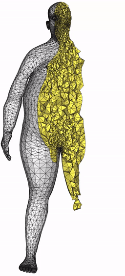
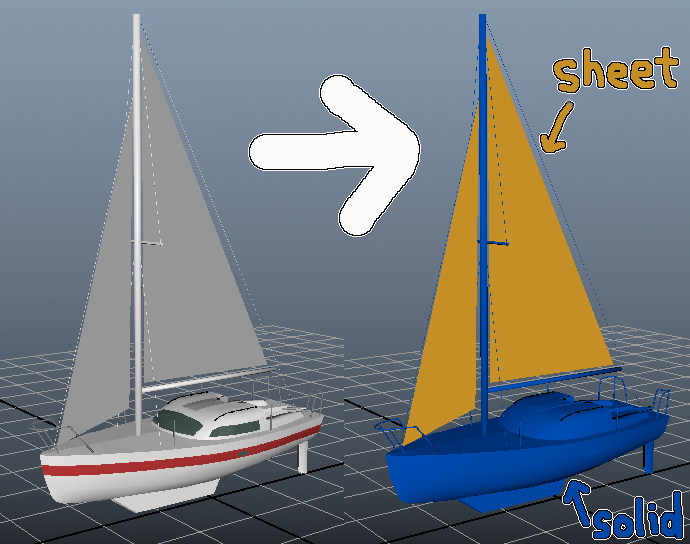
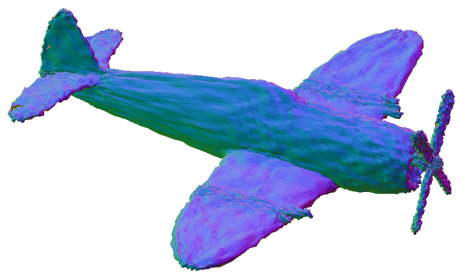
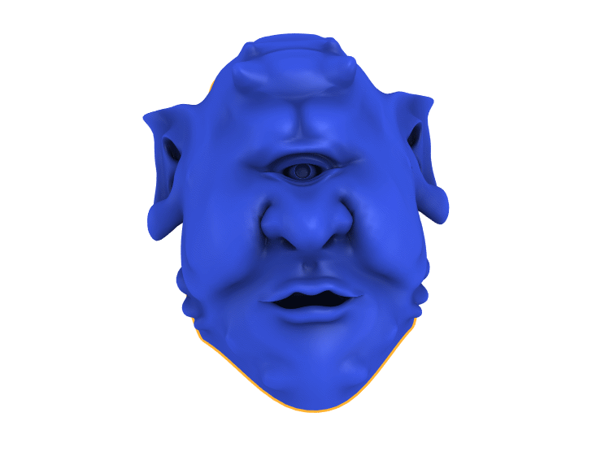
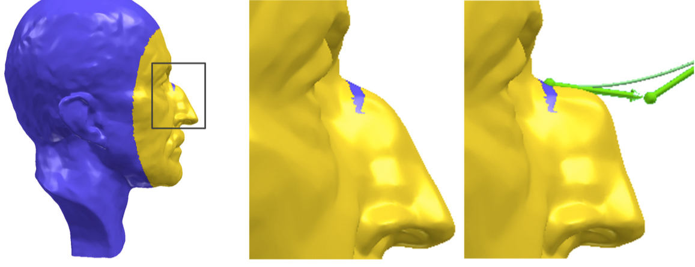
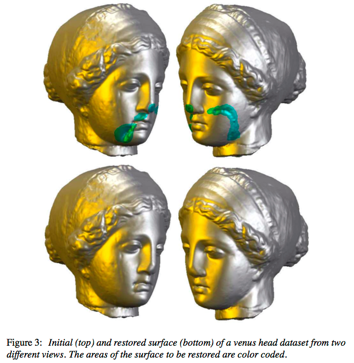
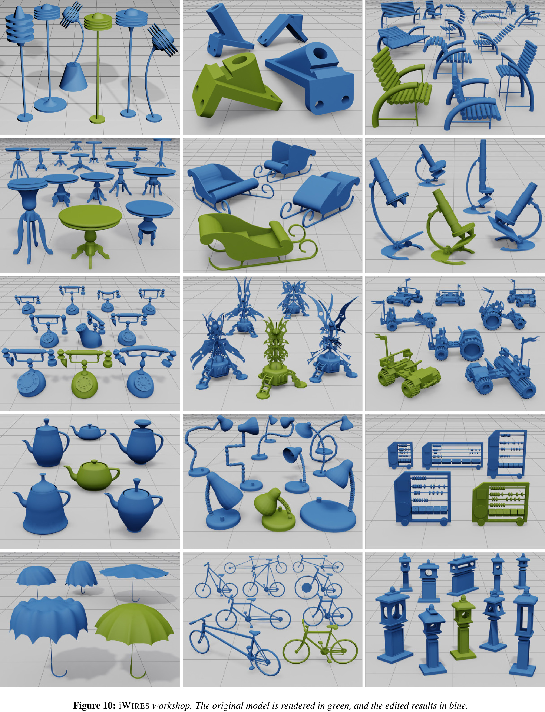
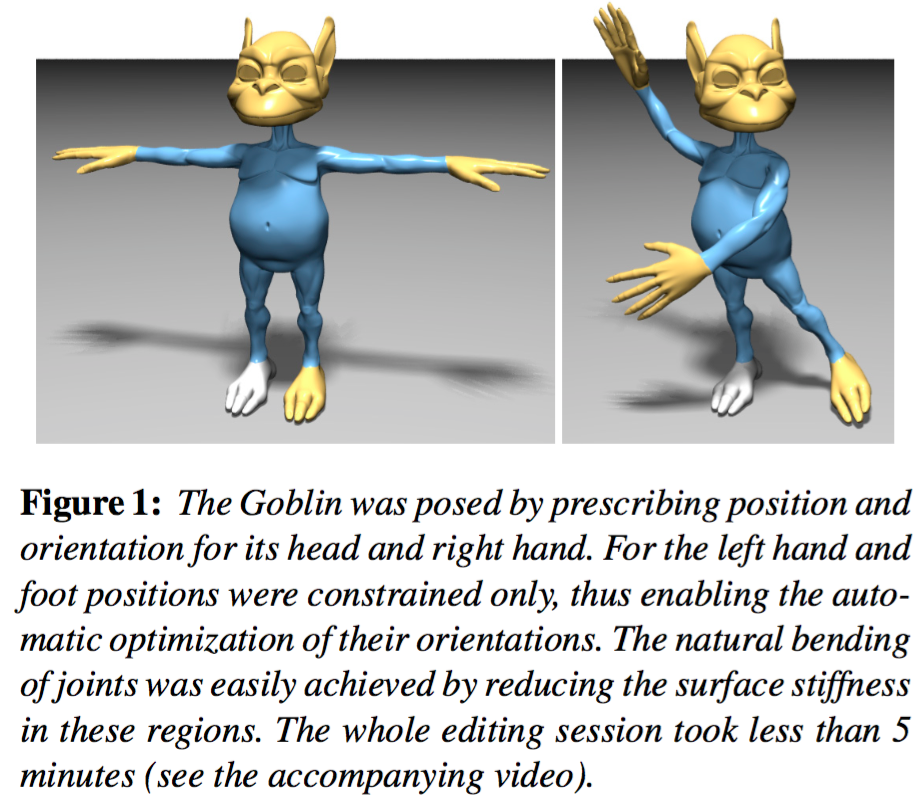
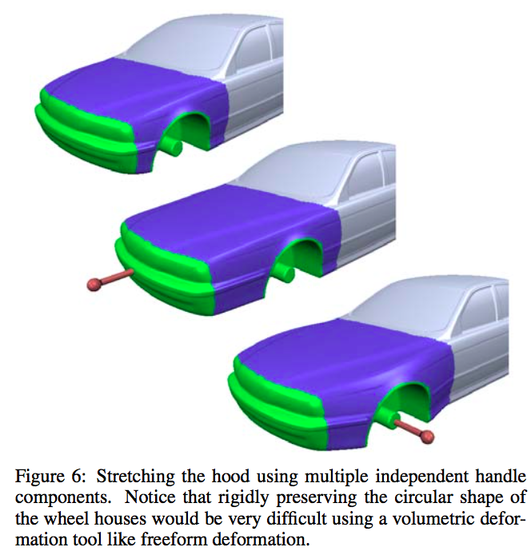
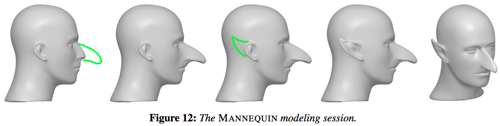

# [Geometry Processing](../index.html) – Deformation

## Wikipedia progress?

[Geometry processing: Revision history](https://en.wikipedia.org/w/index.php?title=Geometry_processing&action=history)

Needs **images**!

Needs **citations**!

## Final project ideas

- Robust [TetGen](http://wias-berlin.de/software/tetgen/) using irrational
  numbers. [Si 2015].



- "Per-face classification of two-sided sheets vs oriented solid-boundary
  surfaces" (Machine Learning!)
    - [ShapeNet](https://www.shapenet.org/)
    - [Thingi10K](https://ten-thousand-models.appspot.com/)



## Parameterization homework

[readme](https://github.com/alecjacobson/geometry-processing-parameterization)


## Goal: remove noise



## Goal: (non-rigid) registration to another shape

<iframe width="560" height="315" src="https://www.youtube.com/embed/7vkfyCutBjY" frameborder="0" allowfullscreen></iframe>

## Goal: flattening onto the plane



## Goal: changing features of an existing shape ~sculpting~




## Goal: combine/extend/fill holes in existing shapes



## Goal: reposing or iterating a design of an existing shape



## Goal: reposing or iterating a design of an existing shape

<video controls loop>
<source src=videos/armadillo-editing-make-it-stand.mov>
</video>

## Goal: animation

<iframe width="560" height="315"
src="https://www.youtube.com/embed/hldCtjT9baI" frameborder="0"
allowfullscreen></iframe>

## Goal: physical effects

<video controls loop>
<source src=videos/big-buck-bunny-torus-sphere-hyperelastic-materials.mp4>
</video>


## Handle-based deformation: selected transformed regions





## Handle-based deformation: sketched curves



## Handle-based deformation: skeletons

```
/usr/local/igl/libigl-examples/skeleton-poser/build/skeleton_poser /usr/local/igl/libigl-examples/shared/decimated-knight{.obj,.tgf}
```


