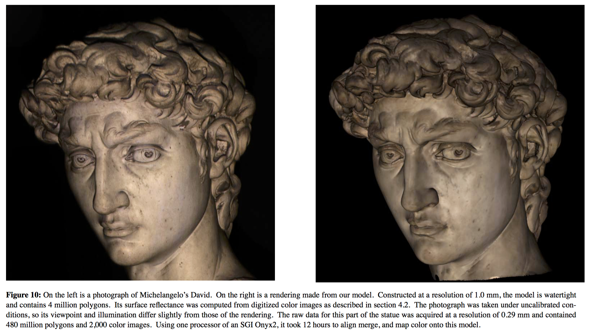
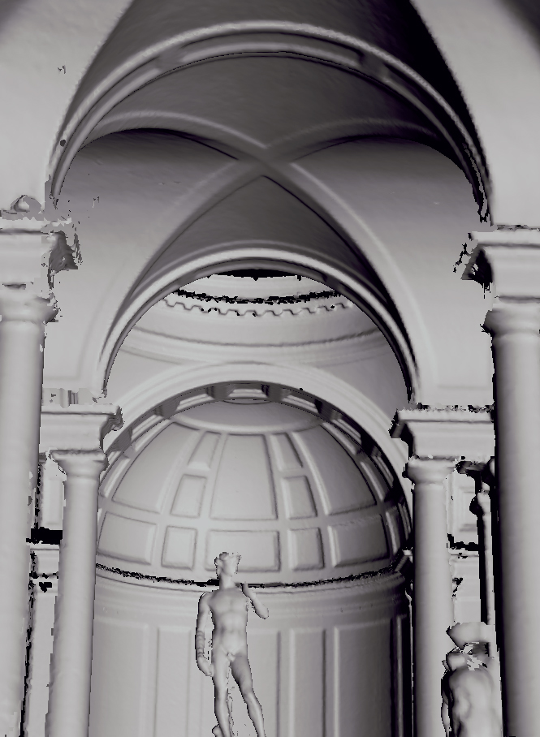
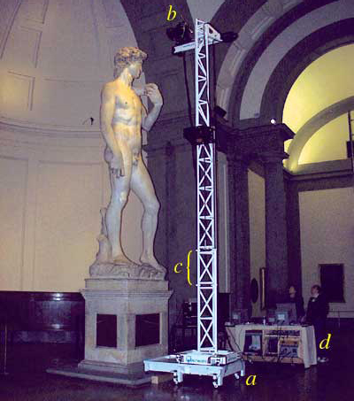
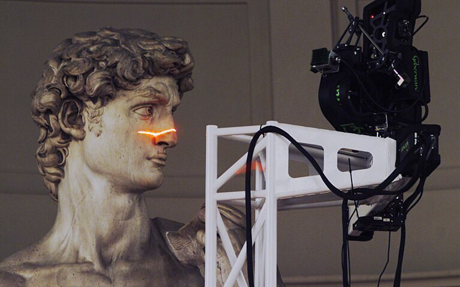
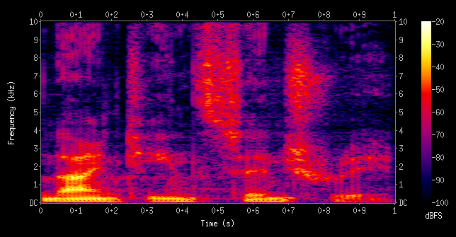
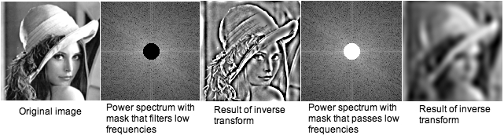
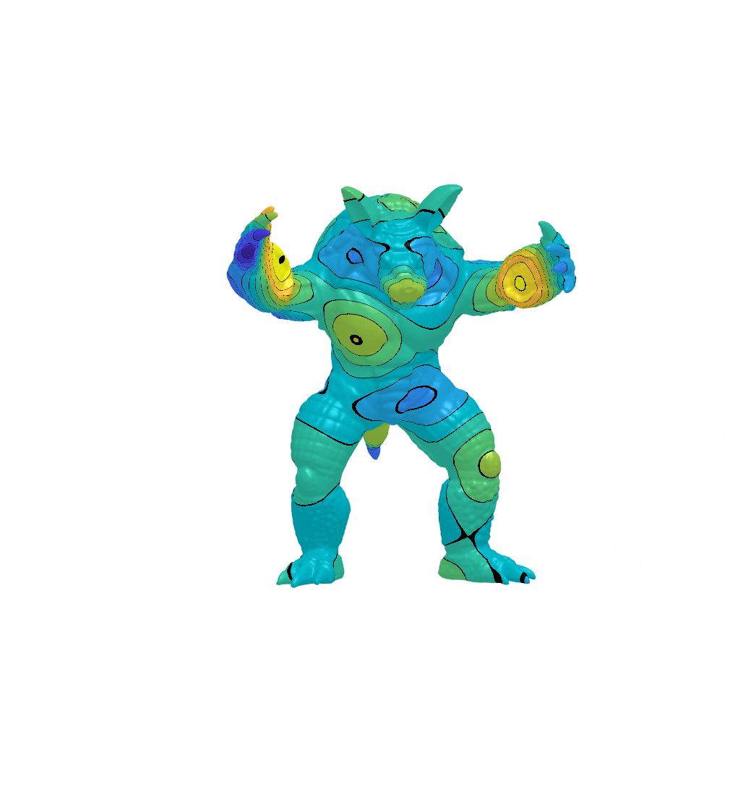
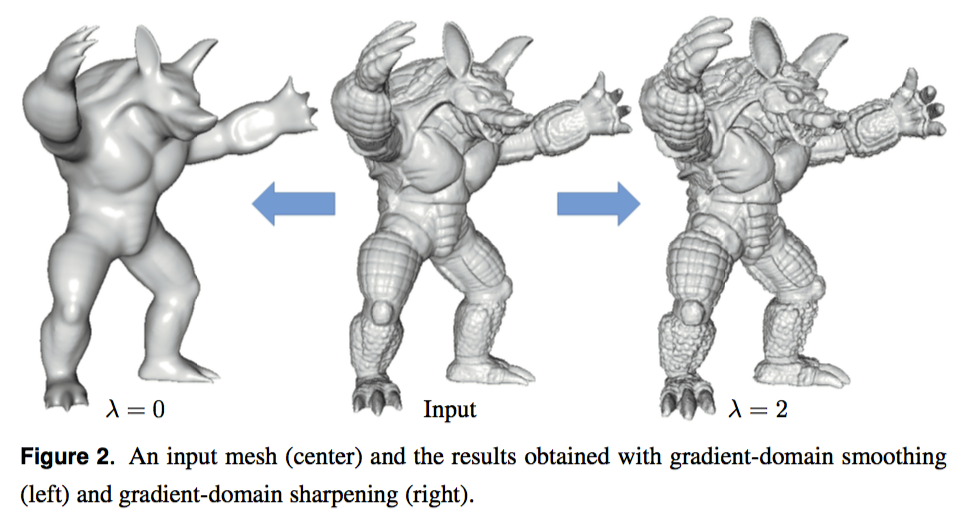

title: Geometry Processing – Introduction
author: Alec Jacobson
html header:  <link rel="stylesheet" href=../style.css>
<link rel="stylesheet" href=style.css>

# Geometry Processing – Introduction

## Laser Scanning

### Scanning Michaelangelo's David sculpture in Rome

"The Digital Michelangelo Project: 3D Scanning of Large Statues" [Levoy et al.
2000]

### Artec's handheld scanning of another David

<video id=scanning-david controls>
<source src=videos/scanning-david-artec.mp4>

</video>
[On YouTube](https://www.youtube.com/watch?v=NWfS4lSr7EU)

### Speed modeling 

_Do Canadians spell modelling with one or two l's?_

<iframe width="560" height="315"
src="https://www.youtube.com/embed/OnGHXARp-Hk" frameborder="0"
allowfullscreen></iframe>

### Smoothing Max Planck

[MATLAB Demo](/Applications/MATLAB_R2017a.app)

### Deforming a character

<video id=scanning-david controls>
<source src=videos/ogre-fast.mp4>
</video>

[FAST Demo](/Users/ajx/Documents/Demo/fast/ogre.app)

### Interactive visualization from CT scans of Mummies

"Interactive visualization of 3d scanned mummies at public venues" [Ynnerman et
al. 2016]

### Spectrogram of the words "nineteenth century"

[On Wikipedia](https://en.wikipedia.org/wiki/Spectrogram)

### Spectral analysis of an image

[Source](http://imagejdocu.tudor.lu/doku.php?id=gui:process:fft)

### Spectral processing to smooth and enhance

"Gradient-Domain Processing of Meshes", [Chuang et al. 20016]

### Wikipedia page for Geometry Processing is pathetic

[Geometry Processing on
Wikipedia](https://en.wikipedia.org/wiki/Geometry_processing)

### libigl is a C++ library for Geometry Processing

[libigl tutorial](http://libigl.github.io/libigl/tutorial/tutorial.html)

