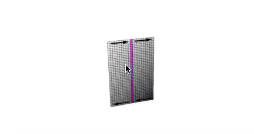

# [Geometry Processing](../index.html) – Mesh Reconstruction

## Wikipedia progress?

[Geometry processing: Revision history](https://en.wikipedia.org/w/index.php?title=Geometry_processing&action=history)

[Geometry processing category](https://en.wikipedia.org/wiki/Category:Geometry_processing)

## Klein bottle

[+plus magazine](https://plus.maths.org/content/introducing-klein-bottle)

[imgur](http://imgur.com/2QvVTzp)

## Sphere eversion

https://www.youtube.com/watch?v=BVVfs4zKrgk (play 0:00 to 1:40)

## Coffee Mug → Donut

https://www.youtube.com/embed/9NlqYr6-TpA?start=43 (just a few secs)

[Wikipedia](https://en.wikipedia.org/wiki/Genus\_(mathematics))

## Facebook graph

[source](https://admin.mashable.com/wp-content/uploads/2010/12/fb-relationships-full.jpg)

## Game of thrones character graph

Has _undirected_ and directed edges:

[source](http://cdn.collider.com/wp-content/uploads/2016/06/game-of-thrones-jon-snow-legacy.png)

## Right-hand rule for mesh orientations

[source](https://raw.githubusercontent.com/alecjacobson/geometry-processing-introduction/master/images/right-hand-rule.jpg)

## Half-edges on mesh

[source](https://raw.githubusercontent.com/alecjacobson/geometry-processing-introduction/master/images/half-edges.jpg)

## Ivan Sutherland's Sketchpad

https://www.youtube.com/embed/USyoT_Ha_bA?start=354

[Sketchpad: A man-machine graphical communication system](https://www.cl.cam.ac.uk/techreports/UCAM-CL-TR-574.pdf)

## "Scanning" a car

[source](http://iasl.uni-muenchen.de/links/GCAPDF/GCAPDF-IV.2e.html)

[source](http://www.computerhistory.org/revolution/computer-graphics-music-and-art/15/206)

## Poisson Surface Reconstruction

[Kazhdan et al. 2006]

