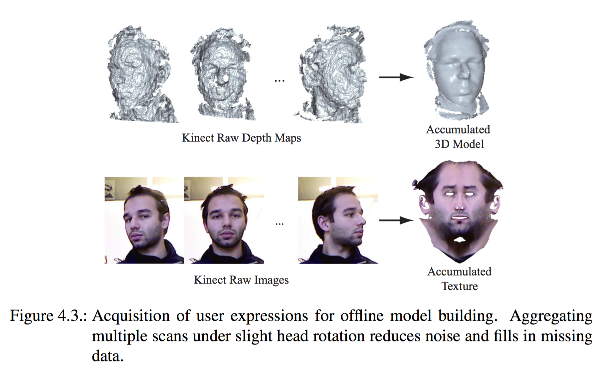
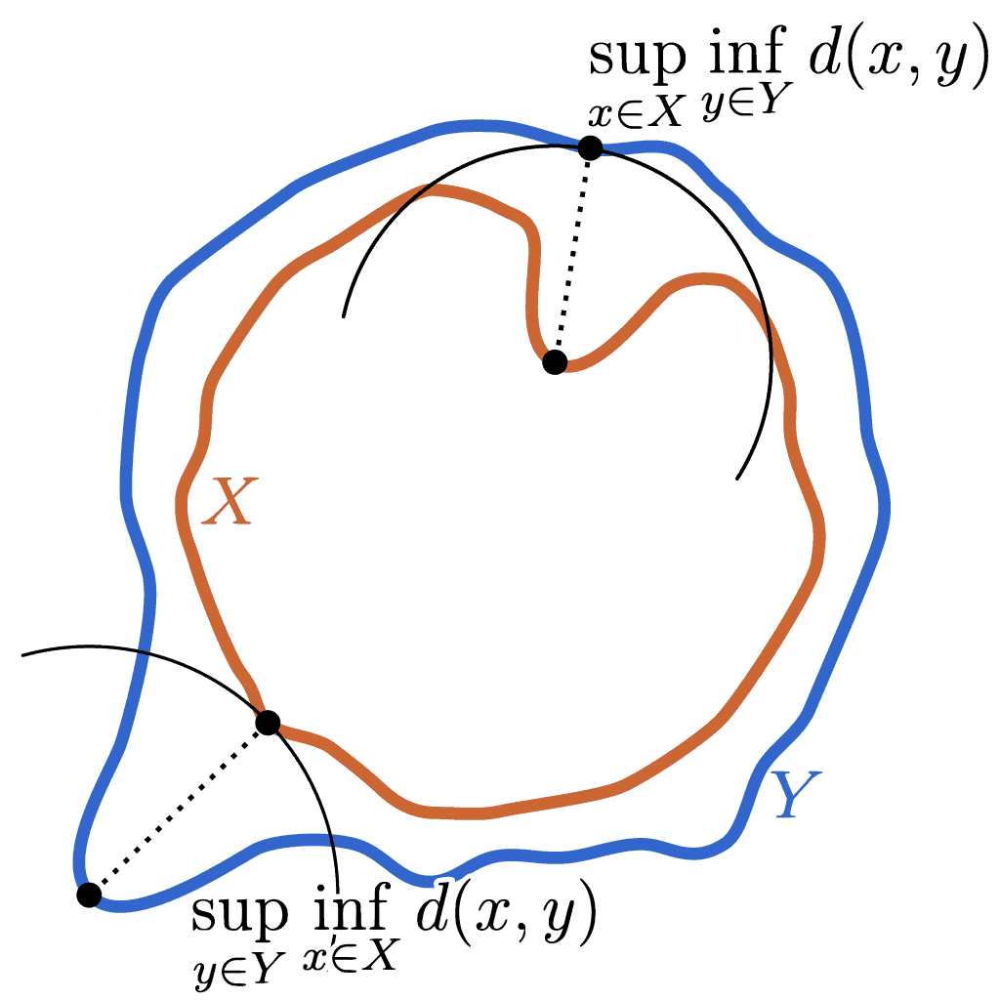

title: Geometry Processing – Alignment and Registration
author: Alec Jacobson
html header:  <link rel="stylesheet" href=../style.css>
<link rel="stylesheet" href=style.css>

# [Geometry Processing](../index.html) – Alignment and Registration

## Edges & Euler Characteristic 

[HW00](https://github.com/alecjacobson/geometry-processing-introduction)

## Wikipedia progress?

[Geometry processing: Revision history](https://en.wikipedia.org/w/index.php?title=Geometry_processing&action=history)

[Geometry processing category](https://en.wikipedia.org/wiki/Category:Geometry_processing)

## Quadratic energies and linear systems

[HW01](https://github.com/alecjacobson/geometry-processing-mesh-reconstruction)

[An Introduction to the Conjugate Gradient Method Without the Agonizing
Pain](https://www.cs.cmu.edu/~quake-papers/painless-conjugate-gradient.pdf),
Shewchuk 1994.

## Registering Multiple Scans

[source](http://www.cs.unc.edu/~yumeng/)

$$\newcommand{\mat}[1]{\mathbf{#1}}$$
$$\newcommand{\vec}[1]{\mathbf{#1}}$$
$$\newcommand{\A}{\mat{A}}$$
$$\newcommand{\B}{\mat{B}}$$
$$\newcommand{\C}{\mat{C}}$$
$$\newcommand{\D}{\mat{D}}$$
$$\newcommand{\I}{\mat{I}}$$
$$\newcommand{\G}{\mat{G}}$$
$$\newcommand{\N}{\mat{N}}$$
$$\newcommand{\P}{\mat{P}}$$
$$\newcommand{\Rot}{\mat{R}}$$
$$\newcommand{\R}{\mathbb{R}}$$
$$\newcommand{\One}{\mathbf{1}}$$
$$\newcommand{\S}{\mathcal{S}}$$
$$\newcommand{\M}{\mat{M}}$$
$$\newcommand{\U}{\mat{U}}$$
$$\newcommand{\V}{\mat{V}}$$
$$\newcommand{\W}{\mat{W}}$$ 
$$\newcommand{\X}{\mat{X}}$$
$$\newcommand{\Y}{\mat{Y}}$$
$$\newcommand{\c}{\vec{c}}$$
$$\newcommand{\f}{\vec{f}}$$
$$\newcommand{\g}{\vec{g}}$$
$$\newcommand{\n}{\vec{n}}$$
$$\newcommand{\p}{\vec{p}}$$
$$\newcommand{\tr}[1]{\mathop{\text{tr}}{\left(#1\right)}}$$
$$\newcommand{\t}{\vec{t}}$$
$$\newcommand{\x}{\vec{x}}$$
$$\newcommand{\y}{\vec{y}}$$
$$\newcommand{\u}{\vec{u}}$$
$$\newcommand{\z}{\vec{z}}$$
$$\renewcommand{\v}{\vec{v}}$$
$$\newcommand{\transpose}{{\mathsf T}}$$
$$\newcommand{\argmin}{\mathop{\text{argmin}}}$$
$$\newcommand{\argmax}{\mathop{\text{argmax}}}$$

### Matching surfaces that share a parameterization

For example, consider if a surface $X$ is given with a parameterization so that
each point on $X$ can be written as a function of parameters $u$ and $v$,
$\x(u,v) ∈ X$. If $Y$ is another surface produced by the same parameterization
($\y(u,v) ∈ Y$), then we can think of $Y$ as a _deformation_ of $X$ (or
vice-versa). Each point $\y(u,v)$ on the surface $Y$ has a natural
corresponding point $\x(u,v)$ on $X$ via the parameters $u$ and $v$.

](images/beetle-deformation.png)

A very natural way to _measure_ the difference between these two surfaces
_aggregate_ the distance between each pair of corresponding points. For
example, we could [integrate](https://en.wikipedia.org/wiki/Integral) this
distance over the parametric domain
([w.l.o.g.](https://en.wikipedia.org/wiki/Without_loss_of_generality) let's say
valid values are $u,v ∈ (0,1)$):

\\[
D_2(X,Y) = \sqrt{ ∫_0^1∫_0^1 ‖\x(u,v) - \y(u,v)‖² \;du\;dv }
\\]

This measure will be zero if the surfaces are the same for any choice of
parameters $u$ and $v$. The measure $D_2(X,Y)$ could large if every point on
$Y$ is _slightly_ deformed or if a few bad points are deformed a lot. This
distance is the [L²
norm](https://en.wikipedia.org/wiki/Norm_(mathematics)#Infinite-dimensional_case)
of the magnitude of the _displacement_ from $X$ to $Y$ (or vice-versa):

\\[
D_2(X,Y) = \sqrt{ ∫_0^1∫_0^1 d(u,v)² \;du\;dv }, \quad \text{ and } \quad d(u,v) = ‖\x(u,v) -
\y(u,v)‖
\\]

We can directly measure the _maximum_ distance between corresponding
points, the $L^∞$ norm:

\\[
D_∞(X,Y) = \lim_{p→∞} \sqrt[p]{∫_0^1∫_0^1 d(u,v)^p \;du\;dv } = \sup\limits_{u,v ∈
(0,1)} ‖\x(u,v) - \y(u,v)‖,
\\]

where $\sup$ takes the
[supremum](https://en.wikipedia.org/wiki/Infimum_and_supremum) (roughly the continuous math
analog of the [maximum](https://en.wikipedia.org/wiki/Maxima_and_minima)).

The measure $D_∞$ will also be exactly zero if the surfaces are the same.

#### Triangle meshes

On the computer, we can store an explicit surface as a triangle mesh. Triangle
meshes have an _implicit_ parameterization: each triangle can be trivially
and independently mapped to the unit triangle, via its [barycentric
coordinates](https://en.wikipedia.org/wiki/Barycentric_coordinate_system#Barycentric_coordinates_on_triangles).

Triangle meshes also afford an immediate analog of deformation: moving each
vertex of the mesh (without change the mesh combinatorics/topology).

So if $\V_X ∈ \R^{n × 3}$ represents the vertices of our surface $X$ with a set
$F$ of $m$
triangular faces and  $\V_Y ∈ \R^{n × 3}$ the vertices of deformed surface $Y$,
then we can rewrite our measure $D_2$ above as a sum of integrals over each
triangle:

\\[
∑\limits_{\{i,j,k\} ∈ T}  \sqrt{ ∫_0^{1-u} ∫_0^1 
\left\|
\underbrace{\left(u \v_x^i + v \v_x^j + (1-u-v) \v_x^k\right)}_\x
-
\underbrace{\left(u \v_y^i + v \v_y^j + (1-u-v) \v_y^k\right)}_\y
\right\|^2 \;du\;dv }
\\]

> **Note:** The _areas_ of the triangles in our mesh may be different. So this
> measure may be thrown off by a very large triangle with a small difference
> and may fail to measure a very small triangle with a large difference. We'll
> learn how to account for this, later.

Unfortunately, in many scenarios we do not have two co-parameterized surface or
a simple per-vertex mesh deformation. Instead, we may have two arbitrary
surfaces discretized with different meshes of different
topologies. We will need a measure of difference or distance between two
surfaces that does not assume a shared parameterization.

### (undirected) Hausdorff distance

To form a [metric](https://en.wikipedia.org/wiki/Metric_(mathematics)) in the
mathematical sense, a distance measure should be symmetric: distance from $X$
to $Y$ equals distance from $Y$ to $X$. Hausdorff distance is defined as the
maximum of directed Haurdorff distances:

\\[
D_{H}(X,Y) = \max \left[ D_{\overrightarrow{H}}(X,Y)\ , \ D_{\overrightarrow{H}}(Y,X) \right].
\\]

Unlike each individual directed distance, the (undirected) Hausdorff distance
will measure zero [if and only
if](https://en.wikipedia.org/wiki/If_and_only_if) the [point
set](https://en.wikipedia.org/wiki/Euclidean_space#Balls.2C_spheres.2C_and_hypersurfaces)
of the surface $X$ is identical to that of $Y$.

#### Hausdorff distance between triangle meshes

On the computer, surfaces represented with triangle meshes (like any point set)
admit a well-defined Hausdorff distance between one-another. Unfortunately,
computing _exact_ Hausdorff distance between two triangle meshes remains a
difficult task: existing exact algorithms are prohibitively inefficient.

We do not know [_a
priori_](https://en.wikipedia.org/wiki/A_priori_and_a_posteriori) which
point(s) of each triangle mesh will end up determining the maximum value. It is
tempting, optimistic, but ultimately incorrect to assume that the _generator_
points will be one of the vertices of the triangle mesh. Consider if a triangle
$t$ connected corners at $(1,1,0)$, $(1,0,1)$ and $(0,1,1)$ and $B$ was a mesh
with two triangles, the first connecting $(0,0,0)$, $(1,0,1)$ and $(1,1,0)$ and
the second connecting $(0,0,0)$, $(0,1,1)$ and $(1,1,0)$. The corners of $t$
also appear as vertices of $B$, so clearly their respective vertex-to-mesh
distances are zero, yet the maximum minimum distance from $t$ to $B$ is clearly
non-zero (it is $\sqrt{3}/3$).

One might also optimistically, but erroneously hope that by considering the
symmetric Hausdorff distance one of the _generator_ points must lie on a vertex
of $A$ or of $B$. Unfortunately, this only follows for convex shapes.

## Integrated closest-point distance

## Symmetric matching distance

We can similarly define a symmetric distance by _summing_ the two directed
distances:

\\[
D_{C}(X,Y) = 
D_{\overrightarrow{C}}(X,Y) +
D_{\overrightarrow{C}}(Y,X) = 
\sqrt{\ ∫\limits_{\x∈X} ‖\x - P_Y(\x) ‖² \;dA }+
\sqrt{\ ∫\limits_{\y∈Y} ‖\y - P_X(\y) ‖² \;dA }.
\\]

## Unconstrained ICP

If we place no restrictions or
[constraints](https://en.wikipedia.org/wiki/Constrained_optimization) on the
transformation $T: \R³ → \R³$, then there are many [trivial
solutions](https://en.wikipedia.org/wiki/Triviality_(mathematics)) to
minimizing $E_{\overrightarrow{C}}(T(X),Y)$. For example, we could simply
define $T$ so that every point $\x$ gets mapped to its closest point on $Y$:
$T(\x) := P_Y(\x)$. This would clearly induce $E_{\overrightarrow{C}}=0$.
Actually, we could get zero energy even if we define $T$ to map _all_ points on
$X$ to the same _arbitrary_ point on $Y$: $T(\x) := \y$.

> ### Symmetric energy for complete matches
> 
> If $X$ and $Y$ are _complete_ matches, then one way to remove these trivial
> solutions is to minimize the symmetric energy summing energies from $X$ to $Y$
> and from $Y$ to $X$:
> 
> \\[
> E_C(T(X),Y) = E_{\overrightarrow{C}}(T(X),Y) + E_{\overrightarrow{C}}(Y,T(X)).
> \\]
> 
> Appending the energy $E_{\overrightarrow{C}}(Y,T(X))$ measure the distance
> from all points on $Y$ to the transformed surface $T(X)$ ensures that we will
> not get zero energy if some part of $Y$ does not get matched to some part of
> $X$.

