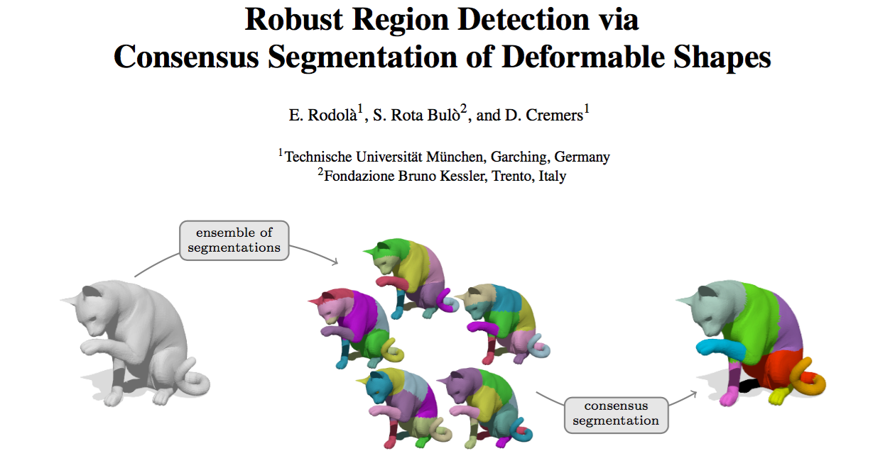
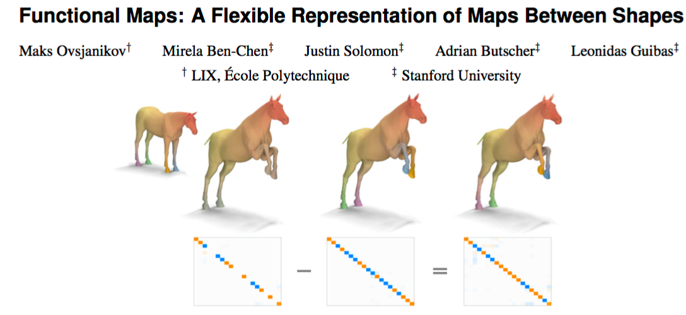
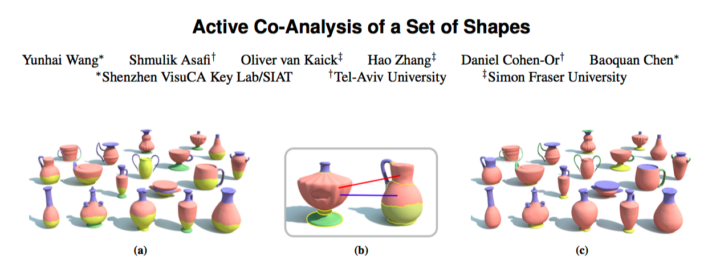
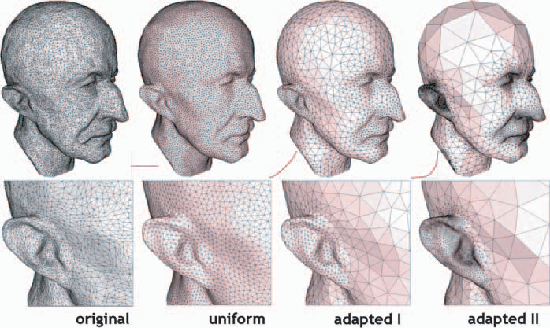
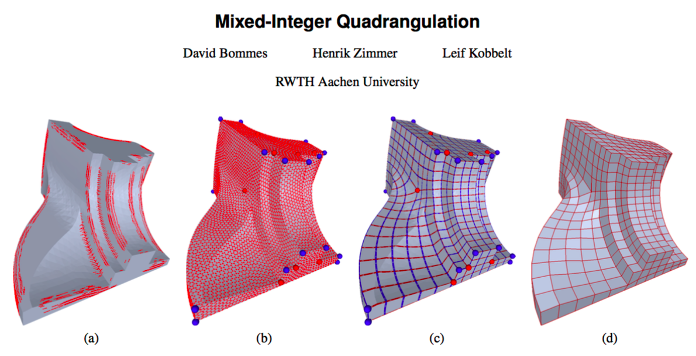
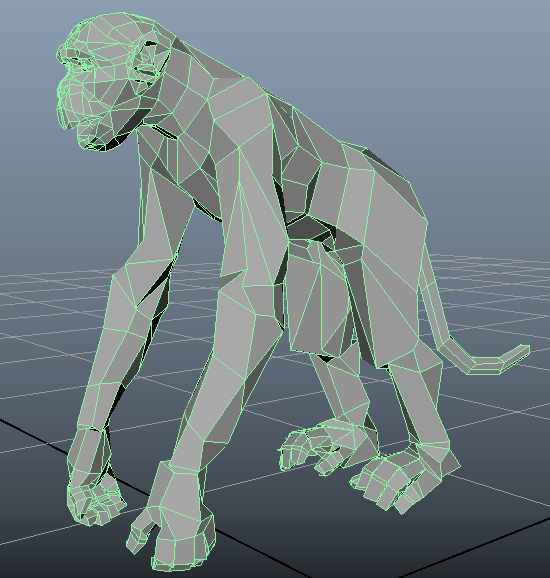
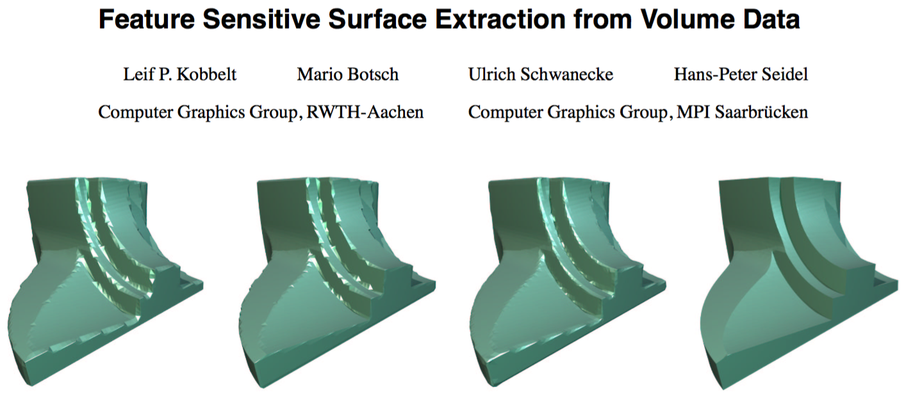

# [Geometry Processing](../index.html) – Signed Distances

## Final Projects

### Presentations

10 mins, hard limit

Try to save a minute or two for questions

(ask questions; recall 20% of grade is participation)

### Extended abstract

Practice formal presentation

### Deadlines

 - 25/4 SIGGRAPH Posters
 - 10/4 SGP Papers → Posters
 - 14/4 SCA Papers, 26/5 Posters 

**_All materials due Friday 6/4(April)/2018_**

## Wikipedia

[Geometry Processing on wikipedia](https://en.wikipedia.org/wiki/Geometry_processing)

Last chance. Currently sitting around 50%

- Love the images
- How about references to relevant papers?

## Cutting room floor

### Segmentation

### Shape correspondence

### Co-analysis

### Mesh simplification

### Remeshing

### Quad meshing

### Volume meshing

### Subdivision surfaces

----------------------------------------------------------

## Feature Sensitive Surface Extraction

